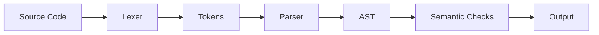

<div align="center">

# 🌊 Sea Compiler


A Java-based compiler featuring **lexical analysis, parsing,
abstract syntax trees (ASTs), and basic semantic analysis.**

</div>


## 📑 Table of Contents

- [🚀 Overview](#-overview)
- [✨ Features](#-features)
- [🏗️ Compiler Architecture](#️-compiler-architecture)
- [🖥️ Demo & Screenshots](#️-demo--screenshots)
- [📂 Project Structure](#-project-structure)
- [⚙️ Installation & Usage](#️-installation--usage)
- [🛠️ Technologies](#️-technologies)
- [📌 About](#-about)

---


## 🚀 Overview
Sea Compiler is a Java-based compiler design project developed as a university project for the Compiler Design course.

The project implements lexical analysis and parsing for a simple programming language using `.sea` source files. It can tokenize source code, recognize different language constructs, build abstract syntax trees (ASTs) for arithmetic expressions, and perform several basic semantic checks.


## ✨ Features

- 🔍 **Lexical Analysis:** Tokenization, keyword and literal recognition, comment handling, and error detection.

- 🧩 **Syntax Analysis:** Parsing variables, functions, classes, conditions, loops, and arithmetic expressions.

- 🌳 **Abstract Syntax Tree (AST):** Tree generation, visualization, and integer expression evaluation.

- 🛡️ **Semantic Analysis:** Scope management, duplicate declaration detection, function validation, and basic type checking.

---


## 🏗️ Compiler Architecture

Sea Compiler processes `.sea` source files through multiple compilation stages.



---


### Lexical Analysis

The lexer reads source code from a `.sea` file and converts it into tokens.

It supports:

- Keywords
- Identifiers
- Integer literals
- Float literals
- Double literals
- String literals
- Operators
- Symbols
- Single-line comments (`//`)
- Multi-line comments (`/* */`)
- Line and column tracking
- Detection of unknown characters

### Parsing

The parser recognizes several programming language constructs, including:

- Variable declarations
- Variable initialization
- Function declarations
- Function calls
- Function parameters
- Return statements
- Classes
- `if`, `else if`, and `else` statements
- `for` and `while` loops
- Increment and decrement operations

### Expression Processing

The project supports arithmetic expressions containing:

- Addition
- Subtraction
- Multiplication
- Division
- Parentheses

Operator precedence is handled during expression parsing.

For integer expressions, the parser can also evaluate the expression and display its result.

### Abstract Syntax Tree (AST)

Arithmetic expressions are represented using an Abstract Syntax Tree.

The AST implementation includes:

- `ASTNode` – Base class for AST nodes
- `BinaryOpNode` – Represents binary arithmetic operations
- `NumberNode` – Represents numeric values

The generated AST can also be printed in a tree-like structure.

### Semantic Checks

The parser performs several basic semantic checks, including:

- Detecting duplicate variable declarations in the same scope
- Detecting duplicate function definitions
- Detecting duplicate class definitions
- Checking whether a `main` function exists
- Detecting multiple `main` functions
- Checking the return type and parameters of `main`
- Detecting calls to undefined functions
- Checking function argument count and types
- Basic scope management
- Basic circular class dependency detection


---

## 🖥️ Demo & Screenshots

Sea Compiler Studio provides a graphical interface for exploring the compilation process.


The interface includes:
- **Source Editor:** Write and edit `.sea` source code.
- **Token Inspector:** View tokens with their types, values, line numbers, and column positions.
- **AST Visualizer:** Explore the generated abstract syntax tree.
- **Compiler Output:** View parsing results and expression evaluation.

---


## 📂 Project Structure

```text
Sea-Compiler/
│
├── input.sea
├── README.md
│
└── src/
    └── compiler/
        ├── ASTNode.java
        ├── ASTVisualizer.java
        ├── BinaryOpNode.java
        ├── ExpressionNode.java
        ├── Lexer.java
        ├── Main.java
        ├── NumberNode.java
        ├── Parser.java
        ├── ParserMain.java
        ├── SeaCompilerGUI.java
        ├── Token.java
        └── TokenType.java
```


## Running the Project

1. Clone the repository.
2. Open the project in IntelliJ IDEA or another Java IDE.
3. Add or modify the source code inside `input.sea`.
4. Run `Main.java` to perform lexical analysis and display the generated tokens.
5. Run `ParserMain.java` to perform lexical analysis followed by parsing and semantic checks.

## Technologies

- Java
- Object-Oriented Programming
- Lexical Analysis
- Parsing
- Abstract Syntax Trees
- Basic Semantic Analysis
- IntelliJ IDEA

## About

This project was developed as a university Compiler Design project to practice the fundamental stages of compiler construction, including lexical analysis, parsing, abstract syntax tree generation, expression evaluation, scope handling, and basic semantic analysis.
