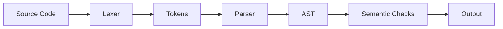
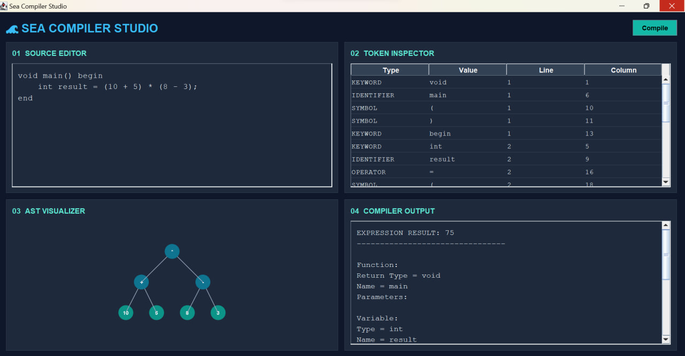

<div align="center">

# 🌊 Sea Compiler

### A Java-Based Compiler with Interactive AST Visualization

<br>


<br>

A compiler design project featuring **lexical analysis, parsing,  
abstract syntax trees (ASTs), and basic semantic analysis.**

Explore the compilation process through an interactive
graphical interface.

<br>

[**Explore the Demo**](#️-demo--screenshots) •
[**Get Started**](#️-installation--usage)

</div>

---


## 📑 Table of Contents

- [🚀 Overview](#-overview)
- [✨ Features](#-features)
- [🏗️ Compiler Architecture](#️-compiler-architecture)
- [🖥️ Demo & Screenshots](#️-demo--screenshots)
- [📂 Project Structure](#-project-structure)
- [⚙️ Installation & Usage](#️-installation--usage)
- [🛠️ Technologies](#️-technologies)
- [📌 About](#-about)

---


## 🚀 Overview
Sea Compiler is a Java-based compiler design project developed as a university project for the Compiler Design course.

The project implements lexical analysis and parsing for a simple programming language using `.sea` source files. It can tokenize source code, recognize different language constructs, build abstract syntax trees (ASTs) for arithmetic expressions, and perform several basic semantic checks.


## ✨ Features

- 🔍 **Lexical Analysis:** Tokenization, keyword and literal recognition, comment handling, and error detection.

- 🧩 **Syntax Analysis:** Parsing variables, functions, classes, conditions, loops, and arithmetic expressions.

- 🌳 **Abstract Syntax Tree (AST):** Tree generation, visualization, and integer expression evaluation.

- 🛡️ **Semantic Analysis:** Scope management, duplicate declaration detection, function validation, and basic type checking.

---


## 🏗️ Compiler Architecture

Sea Compiler processes `.sea` source files through multiple compilation stages.



---


### Lexical Analysis

The lexer reads source code from a `.sea` file and converts it into tokens.

It supports:

- Keywords
- Identifiers
- Integer literals
- Float literals
- Double literals
- String literals
- Operators
- Symbols
- Single-line comments (`//`)
- Multi-line comments (`/* */`)
- Line and column tracking
- Detection of unknown characters

### Parsing

The parser recognizes several programming language constructs, including:

- Variable declarations
- Variable initialization
- Function declarations
- Function calls
- Function parameters
- Return statements
- Classes
- `if`, `else if`, and `else` statements
- `for` and `while` loops
- Increment and decrement operations

### Expression Processing

The project supports arithmetic expressions containing:

- Addition
- Subtraction
- Multiplication
- Division
- Parentheses

Operator precedence is handled during expression parsing.

For integer expressions, the parser can also evaluate the expression and display its result.

### Abstract Syntax Tree (AST)

Arithmetic expressions are represented using an Abstract Syntax Tree.

The AST implementation includes:

- `ASTNode` – Base class for AST nodes
- `BinaryOpNode` – Represents binary arithmetic operations
- `NumberNode` – Represents numeric values

The generated AST can also be printed in a tree-like structure.

### Semantic Checks

The parser performs several basic semantic checks, including:

- Detecting duplicate variable declarations in the same scope
- Detecting duplicate function definitions
- Detecting duplicate class definitions
- Checking whether a `main` function exists
- Detecting multiple `main` functions
- Checking the return type and parameters of `main`
- Detecting calls to undefined functions
- Checking function argument count and types
- Basic scope management
- Basic circular class dependency detection


---

## 🖥️ Demo & Screenshots

Sea Compiler Studio provides a graphical interface for exploring the compilation process.



The interface includes:
- **Source Editor:** Write and edit `.sea` source code.
- **Token Inspector:** View tokens with their types, values, line numbers, and column positions.
- **AST Visualizer:** Explore the generated abstract syntax tree.
- **Compiler Output:** View parsing results and expression evaluation.

---


## 📂 Project Structure

```text
Sea-Compiler/
│
├── input.sea
├── README.md
│
└── src/
    └── compiler/
        ├── ASTNode.java
        ├── ASTVisualizer.java
        ├── BinaryOpNode.java
        ├── ExpressionNode.java
        ├── Lexer.java
        ├── Main.java
        ├── NumberNode.java
        ├── Parser.java
        ├── ParserMain.java
        ├── SeaCompilerGUI.java
        ├── Token.java
        └── TokenType.java
```


## ⚙️ Installation & Usage

### Prerequisites

Before running the project, make sure you have:

- Java JDK 17 or later
- IntelliJ IDEA or another Java IDE
- Git (optional)

### 1. Clone the Repository

Clone the project using Git:

```bash
git clone https://github.com/nilaheydari/Sea-Compiler.git
```

Open the `Sea-Compiler` folder in IntelliJ IDEA.

### 2. Run Sea Compiler Studio

For an interactive experience, run:

`src/compiler/SeaCompilerGUI.java`

The graphical interface allows you to:

- Write and edit Sea source code.
- Compile code using the **Compile** button.
- Inspect generated tokens and their positions.
- Visualize arithmetic expression ASTs.
- View parsing output and expression evaluation results.

### 3. Run the Command-Line Version

The project also provides two command-line entry points.

**Lexical Analysis**

Edit `input.sea` and run:

`src/compiler/Main.java`

This displays the generated tokens.

**Parsing and Semantic Analysis**

Edit `input.sea` and run:

`src/compiler/ParserMain.java`

This performs lexical analysis, parsing, and basic semantic checks.

### 4. Example

Try the following code in Sea Compiler Studio:

```text
void main() begin
    int result = (10 + 5) * (8 - 3);
end
```

The compiler evaluates the arithmetic expression:

```text
EXPRESSION RESULT: 75
```

The generated AST can also be explored in the graphical interface.

---


## 🛠️ Technologies

### Languages & Tools

<p>
  
  
  
  
  
</p>

### Core Concepts

- Object-Oriented Programming (OOP)
- Lexical Analysis & Tokenization
- Recursive-Descent Parsing
- Abstract Syntax Trees (AST)
- Arithmetic Expression Evaluation
- Basic Semantic Analysis
- Graphical User Interface (Java Swing)

---


## About

This project was developed as a university Compiler Design project to practice the fundamental stages of compiler construction, including lexical analysis, parsing, abstract syntax tree generation, expression evaluation, scope handling, and basic semantic analysis.
